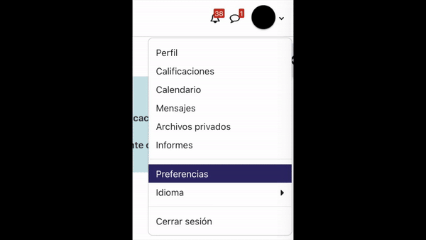

# AGDownloader

AGDownloader is a simple and easy-to-use downloader for [AulaGlobal](https://aulaglobal.uc3m.es/) (the implementation of moodle by the University Carlos III of Madrid). It is a command-line tool, with an easy-to-use Terminal User Interface, that allows you to download all the files from all the courses a user has access to.

You can also indicate the course ID or names of the courses you want to download, and the program will only download the files from those courses.

## Demo

<!-- Video -->
https://github.com/user-attachments/assets/f5d0c692-27ba-4b43-8993-38c7a8946517


## Usage

To download the program, go to the [releases page](https://github.com/Astrak00/AGDownloader/releases/latest) and download the latest version for your operating system. You can also [build](#build-from-source) the program from source by following the instructions below.

> [!NOTE]
> Darwin = MacOS
> ARM = M1/M2/M3 and Snapdragon

To use AGDownloader, execute the following command:

```
./AGDownloader
```

The program will guide you through the process of obtaining the token and setting the other parameters, including [the token](#obtaining-the-aulaglobal-token).

Alternatively, you can specify some the program's parameters through the [CLI](#command-line-interface).

### Obtaining the AulaGlobal token

In order for the application to retrieve the data from AulaGlobal, you must log in with the use of a token.

Currently, you can't obtain the token through the website. Fortunately, there are other ways, like obtaining it through the session cookie, or inspecting the requests made by the mobile application.

The easiest way is through the cookie. The program will guide you through the process, and save the token in the `aulaglobal-token` file.

<details>
  <summary>Obtaining the cookie 🍪</summary>

1. Log into [Aula Global](https://aulaglobal.uc3m.es) through your browser.
2. Open the browser's developer tools (F12)
3. Go to the console tab, and run the following command:
   ```js
   console.log(("; " + document.cookie).split("; MoodleSessionag=").pop().split(";").shift());
   ```

<!-- Video -->
https://github.com/user-attachments/assets/b32e1a62-0ea5-4492-838b-74648addadcf

</details>

<details>
  <summary>Deprecated way of obtaining the token</summary>
To obtain the token, you must log in to AulaGlobal and go to the preferences panel. There, you will find the token under the "Security keys" section. Copy the token and paste it into the program when prompted.



</details>

### Command-Line Interface

You can specify the program's parameters in order to automate and tweak the download process.

You can see a full list of parameters through the use of the `--help` flag:

```
./AGDownloader --help

Usage of ./AGDownloader:
      --courses strings   Ids or names of the courses to be downloaded, enclosed in ", separated by spaces.
                          "all" downloads all courses
      --dir string        Directory where you want to save the files
      --fast              Set MaxGoroutines to the number of files for fastest downloading
      --l string          Language of the course names: ES (Español) or EN (English) (default "ES")
      --p int             Number of cores to be used while downloading
      --token string      Aula Global user security token 'aulaglobalmovil'
      --web               Select the courses using the web interface
```

This is an example of a full command:

```bash
./AGDownloader --token aaaa1111bbbb2222cccc3333dddd4444 --dir download_files --p 5 --courses "Inteligencia Distribuidos 123445"
```

This program will run with the secret token `aaaa1111bbbb2222cccc3333dddd4444`, in the `download_files` sub-folder, using 5 cores, and downloading all courses that contain the words "Inteligencia" or "Distribuidos" in their name, or the course with the ID `123445`.

#### Web

If you prefer to select the courses using the web interface, you can use the `--web` flag. This will open a browser window where you can select the courses you want to download. The program will then download the files from the selected courses.

In the future this might become the default and a --cli or --no-web flag will be added.

#### Language

You can choose the language of the course names with the `--l` parameter. The possible values are:

- `ES`: Spanish
- `EN`: English

#### Courses

You can specify the courses you want to download by using the `--courses` parameter. You can specify the courses by their ID or by their name. If you want to download all the courses, you can use the keyword `"all"`.

```
./AGDownload --courses "Ingeniería Inteligencia"
```

This parameter will download all the courses that contain the words "Ingeniería" or "Inteligencia" in their name.

#### Directory

You can specify the directory where you want to save the files by using the `--dir` parameter. You must specify the path to the directory where you want to save the files. If you want to download the files in the same directory where the program is being run, you can put a dot.

```
./AGDownload --dir .
```

#### Cores

You can specify the number of cores you want to use while downloading the files by using the `--p` parameter. The default value is 4.

```
./AGDownload --p 8
```

You can also specify the `--fast` flag that sets the number of processes to the total number of files you will be downloading. This is the fastest way of downloading but may consume more resources.

### F.A.Q.

- [The application stopped working and it shows an error when trying to obtain the user's credentials](#the-application-stopped-working-and-it-shows-an-error-when-trying-to-obtain-the-user's-credentials)

#### The application stopped working and it shows an error when trying to obtain the user's credentials

Your token may be expired. Delete the `aulaglobal-token` file and generate a new one.

## Building from source

To build the program from source, you will need to have Go installed on your computer. You can download it from the [official website](https://golang.org/). Once you have installed Go, you can clone the repository and build the program by running the following commands:

```bash
git clone git@github.com:Astrak00/AGDownloader.git
cd AGDownloader/
go build
```

This will create an executable file called AGDownloader that you can run.

## Contributing

Commits messages and PR titles must follow [Conventional Commits Specification](https://www.conventionalcommits.org/).

Pull requests are welcome. For major changes, please open an issue first to discuss what you would like to change.

## Inspiration

This project was inspired by the need to download all the files from all the courses in AulaGlobal. This is a tedious task that can take a lot of time, so I decided to create a tool that would allow me to do this in a simple and easy way.

Previously, I had created a similar tool in Python, but I decided to create a new one in Go because I wanted to learn more about this language and the faster execution time it offers was very appealing to me.

The idea of using the mobile token to authenticate the user was inspired by the project created by [Josersanvil](https://github.com/Josersanvil/AulaGlobal-CoursesFiles). I decided to use this method because it is more secure than using the user's password and because this year, the university removed the login with user and password.

## License

This project is licensed under the MIT License.
